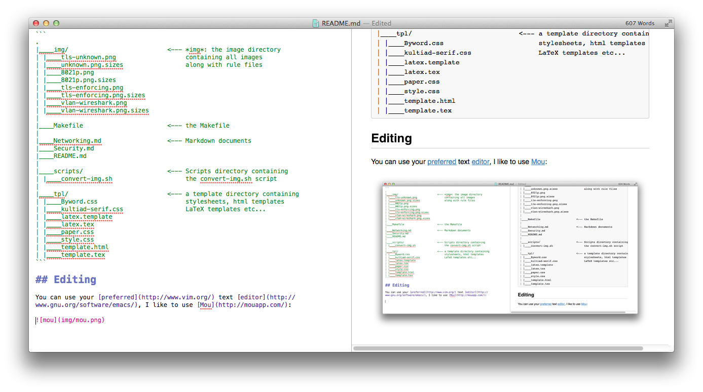

---
title: A Markdown workflow for writing documents
author:
- name: Pietro Bertera
  company: bertera.it
logo: img/logo.png
date: April 2015
abstract: |
   A plaintex, versionable, flexible authoring workflow using Markdown
website: 'http://www.bertera.it'
copyright: 2015 Bertera Pietro
...

## A Markdown workflow for writing documents

### Why Markdown ?

* [Markdown](http://en.wikipedia.org/wiki/Markdown) is a simple and powerful formatting syntax, markdown has a flat learning curve

* Markdown [saves](http://brettterpstra.com/2011/08/31/why-markdown-a-two-minute-explanation/) time (and money): writing in markdown is fast: you musn't fight with a complicated syntax (read: LaTeX) nor you will never feel lost in a deep and deep XML tree (read: Docbook) and you will never need an heavy and buggy WYSIWYG editor.

* Markdown is [plaintext](https://help.github.com/articles/markdown-basics/), so you can use your preferred text editor: showing differences between documents is easy and you can use some tool (diff). Your document can be easily managed by any SCM tool (GIT, SVN, CVS, ...)

* Markdown is [portable](http://mashable.com/2013/06/24/markdown-tools/): you can write your docs in your smartphone, in your web editor or in your standalone application. Your markdown files will never be obsolete or unsupported.

* Markdown is [human readable](https://stackedit.io/): also without any rendering process a markdown file is clean and easy to understand.

* Markdown is [flexible](http://pandoc.org/): you can easily convert a Markdown document into an HTML, a PDF a DOCX or whatever in a few simple step and using numerous tools.

* Markdown supports [workflows](http://programminghistorian.org/lessons/sustainable-authorship-in-plain-text-using-pandoc-and-markdown): with some tools and a simple setup you can automatize your writing-release-publish-print-backup-upload-whatever process: you can script the rendering process, or the publishing and so on.

## Examples

you can see this README document rendered in [HTML](gen/html/README.html), [PDF](gen/pdf/README.pdf), [DOCX](gen/docx/README.docx) or [LaTeX](gen/docx/README.tex).

## The workflow

My workflow is based on a Makefile and consist in a few automated steps:

* copy all the markdown files into the *gen/{format}/* (format is your product format (html, pdf, docx, ... )
* convert all images using the appropriate rule (see below) into the *gen/{format}/img/* directory
* copy all the needed templates into the *gen/{format}/tpl* directory
* run *pandoc* inside the *gen/{format}/* directory in order to create the output document

## Images resize issue

One of the Markdown drawbacks is that doesn't officially supports an image resizing syntax.

This limitation is due by the fact that often the wanted image size depends on the final document format. If your document is rendered as HTML maybe you want bigger images than in A4 PDF rendering.

This limitation can be circumvented using little script and a rule file: the rule file resides along with the file and has a the same name of the image file followed by the suffix `.sizes` E.g.: the image **tls-enforcing.png** has a rule file named **tls-enforcing.png.sizes**.

The rule file contains a list of [convert](http://www.imagemagick.org/script/convert.php) options grouped by format:

### Example: tls-enforcing.png.sizes

```
# This is a comment and will be ignored during the parsing
# The following rule instructs the convert tool to resize 
# the image to the specified size
pdf:-resize 400x50
# The following rule specify a width of 300px for the HTML format
html:-resize 300
# All others format should be unchanged
ALL:
```

#### The *convert-img.sh* script:

This bash script should be launched with 4 command line arguments:

* the image file path
* the needed format
* a directory where the image should copied (after processed by *convert*)

When the script runs it search for the rule file, the rule file is parsed against the format and then the convert command is launched with the format specific options.

So, running the script:

`./scripts/onvert-img.sh img/tls-enforcing.png pdf gen/pdf/img`

The following command will be launched:

`convert -resize 400x50 img/tls-enforcing.png gen/pdf/img/tls-enforcing.png`

In case the rule file is missing or the rule file doesn't contains the needed format the script will search for a fallback rule file named **fallback.sizes**.
In case the fallback file is missing image will be copied withouth modifications into the destination directory.

## The working tree

Following my working directory:

```
.
|____img/                           <--- *img*: the image directory          
| |____tls-unknown.png                   containing all images
| |____tls-unknown.png.sizes             along with rule files
| |____8021p.png
| |____tls-enforcing.png
| |____tls-enforcing.png.sizes
| |____vlan-wireshark.png
| |____fallback.sizes               <--- fallback rules file
|
|____Makefile                       <--- the Makefile
|
|____Networking.md                  <--- Markdown documents
|____Security.md
|____README.md
|
|____scripts/                       <--- Scripts directory containing
| |____convert-img.sh                    the convert-img.sh script 
|
|____tpl/                           <--- a template directory containing
| |____Byword.css                        stylesheets, html templates
| |____kultiad-serif.css                 LaTeX templates etc...
| |____latex.template
| |____latex.tex
| |____paper.css
| |____style.css
| |____template.html
| |____template.tex
```

## Editing

You can use your [preferred](http://www.vim.org/) text [editor](http://www.gnu.org/software/emacs/), I like to use [Mou](http://mouapp.com/):



## Generating the output document

The output document can be easily generated trough the *GNU/Make* command:

`make html` 

Will generate an HTML document into the gen/html/ directory for each Markdown document into the main directory:

```
gen/html/
|____img
|    |____tls-unknown.png
|    |____8021p.png
|    |____tls-enforcing.png
|    |____vlan-wireshark.png
|
|____tpl
|    |____style.css
|    |____template.html
|
|____Networking.html
|____README.html
|____security.html
```

Same thing for *make pdf* and *make docx* commands. *make all* command will export HTML, PDF and DOCX formats.

You can easily configure the whole workflow editing the *Makefile* and format templates.

## Needed tools:

### ImageMagick

[ImageMagick](http://www.imagemagick.org/) s a software suite to create, edit, compose, or convert bitmap images. It can read and write images in a variety of formats (over 200) including PNG, JPEG, JPEG-2000, GIF, TIFF, DPX, EXR, WebP, Postscript, PDF, and SVG. Use ImageMagick to resize, flip, mirror, rotate, distort, shear and transform images, adjust image colors, apply various special effects, or draw text, lines, polygons, ellipses and Bézier curves.

ImageMagick is used by the *convert-img.sh* script.

### LaTex

You need a full working LaTex environment installed. Nedded packages depends from your LaTex template.

### Pandoc

[Pandoc](http://johnmacfarlane.net/pandoc/) is a universal document converter. It works from the command line and you can quickly convert a document between any two formats. These include nearly all formats commonly used for scientific writing such as Word, Markdown, ODT, LaTeX, HTML and RTF.

[Download and install pandoc](http://johnmacfarlane.net/pandoc/installing.html)

### Cool Markdown editors:

#### Texts
[Texts](http://www.texts.io) is rich editor for Markdown, with multiple export options (e.g. PDF, Microsoft Word, LaTeX, HTML, ePub) for OS X and Windows.

#### ByWord
[ByWord](http://www.bywordapp.com) is a simple text editor for OS X and iOS.

#### Mou
[Mou](http://mouapp.com) is a simple, free, and powerful Markdown editor/previewer for OS X.

#### MarkdownPad
[MarkdownPad](http://markdownpad.com/) is a Markdown editor for Windows. Both a Free and a Pro version exist; the latter adds support for (amongst other things) GitHub Flavored Markdown and Markdown Extra (including Tables).

#### MultiMarkdown Composer
"[MultiMarkdown Composer](http://multimarkdown.com) is a text editor for Mac that is designed from the ground up around the MultiMarkdown Syntax. It is designed to make writing in MultiMarkdown (or Markdown) even easier than it already is, with automatic syntax highlighting, built in previews, easy export to any format that is supported by MultiMarkdown, and more!" [http://multimarkdown.com].

#### ReText
[ReText](http://sourceforge.net/p/retext/home/ReText/) is an open-source, platform-independent editor for both Markdown and reStructuredText.

#### Qute

[Qute](https://github.com/fbreuer/qute), is an open source, platform-independent editor for Markdown with MathJax-integrated live-preview.

#### Erato

[Erato](http://9muses.se/erato/) is a markdown editor for Mac users, supporting GitHub Flavored Markdown, including YAML front matter and task lists.

#### Editorial

[Editorial](omz-software.com/editorial/) is a markdown editor app for iOS users that includes inline markdown preview and is extensible with workflows.

#### Sublime Text

[Sublime Text](http://www.sublimetext.com) is a text editor available for OS X, Windows, and Linux. There are packages for working with Markdown and Pandoc, notably [MarkdownEditing](https://packagecontrol.io/packages/MarkdownEditing) and [Pandown](https://packagecontrol.io/packages/Pandown).

#### Atom

[Atom](https://atom.io/) is a hackable text editor available for Linux, OS X and Windows. It is completely open source, collaboratively developed and maintained is GitHub. It supports [GitHub Flavored Markdown](https://help.github.com/articles/github-flavored-markdown/) out of the box.

#### Brackets

[Brackets](http://brackets.io/) is an open source modern text editor available for Linux, OS X and Windows by Adobe. It is collaboratively developed and maintained on GitHub and has over 20,000 stargazers. Brackets supports markdown through

[Markdown](http://blog.brackets.io/2013/04/23/markdown-extension-for-brackets/?lang=en)
[Preview](https://github.com/gruehle/MarkdownPreview)
[extension](https://brackets-registry.aboutweb.com/). There is also a 
[Zotero Integration](http://baig.github.io/brackets-zotero/) extension which lets you search and add citation keys in your scholarly markdown documents from your local [Zotero](https://www.zotero.org/) library.

### Web-based editors

#### Zupadoc
[Zupadoc](http://zupadoc.com) is a web-based markdown editor which exports markdown text to typeset PDFs (articles and slides are available). Integrates with Dropbox.

#### Draft
[Draft](https://draftin.com) is a web-based markdown editor with cloud sync, image hosting and analytics. 

#### Markable 
[Markable](http://markable.in/) is another web-based markdown editor with export and integration options.

#### StackEdit
[StackEdit](https://stackedit.io/editor) is another markdown editor with export and publishing options.

#### Prose.io
[Prose](http://prose.io) is a web-based markdown editor for Github Pages.

#### Authorea  
[Authorea](https://www.authorea.com/) is an online collaborative editor to write scientific, academic, and technical documents online and includes markdown and Latex editing. 

### Previewers

#### Marked
[Marked](http://markedapp.com) is a markdown previewer for OS X.
